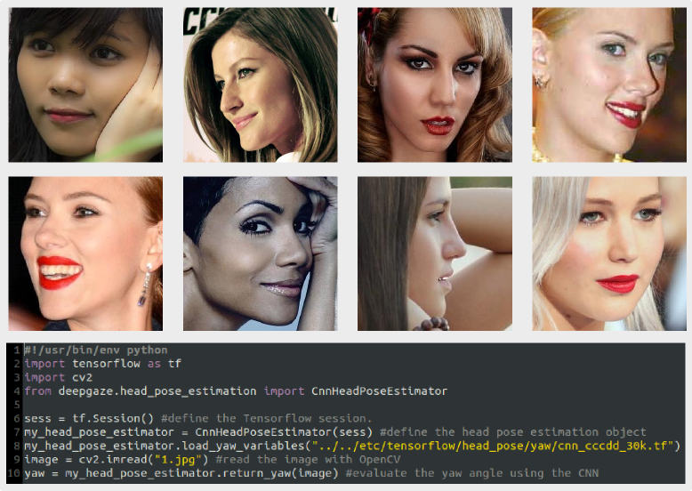

What is deepgaze?
----------
Deepgaze is a library which uses **Convolutional Neural Networks** (CNNs) to estimate the Focus of Attention (FOA) of users. The FOA can be approximately estimated finding the **head orientation**. This is particularly useful when the eyes are covered, or when the user is too far from the camera to grab the eye region with a good resolution. When the eye region is visible it is possible to estimate the **gaze direction**, which is much more informative and can give a good indication of the FOA.

This library is the result of my recent work which is under submission:
*Head Pose Estimation in the Wild using Convolutional Neural Networks and Adaptive Gradient Methods*

**Update 5/10/2016**:
There is a working example on how to use CNNs for head pose estimation (for the moment only yaw angle) [[code]](./examples/ex_cnn_headp_pose_estimation_images/ex_cnn_head_pose_estimation_images.py)

**Update 20/09/2016**:
Work in progress. The code provided at the moment does not still implement gaze detection. There is a beta version of the class which implements the CNN head pose estimator of the yaw angle [[code]](https://github.com/mpatacchiola/deepgaze/blob/master/deepgaze/head_pose_estimation.py). You can use it loading the variables stored in this [[file]](https://github.com/mpatacchiola/deepgaze/blob/master/etc/tensorflow/head_pose/yaw/cnn_cccdd_30k).

There are two examples of head pose estimation using the PnP algorithm with OpenCV Haar detector [[code]](./examples/ex_pnp_head_pose_estimation.py) and with dlib frontal face detector [[code]](./examples/ex_dlib_pnp_head_pose_estimation_video.py). The code for head pose estimation with CNNs will be available at the end of September, and the code for gaze estimation before the end of the year.


What is a Convolutional Neural Network?
------------------------------
A convolutional neural network (CNN, or ConvNet) is a type of feed-forward artificial neural network in which the connectivity pattern between its neurons is inspired by the organization of the animal visual cortex, whose individual neurons are arranged in such a way that they respond to overlapping regions tiling the visual field. Convolutional networks were inspired by biological processes and are variations of multilayer perceptrons designed to use minimal amounts of preprocessing. They have wide applications in image and video recognition, recommender systems and natural language processing [[wiki]](https://en.wikipedia.org/wiki/Convolutional_neural_network)


Prerequisites
------------
To use the libray you have to install:

- Numpy [[link]](http://www.numpy.org/)

```shell
sudo pip install numpy
```

- OpenCV [[link]](http://opencv.org/)

```shell
sudo apt-get install libopencv-dev python-opencv
```

- Tensorflow [[link]](https://www.tensorflow.org/)

```shell
export TF_BINARY_URL=https://storage.googleapis.com/tensorflow/linux/cpu/tensorflow-0.10.0rc0-cp27-none-linux_x86_64.whl
sudo pip install --upgrade $TF_BINARY_URL
```

Some examples may require additional libraries:

- dlib [[link]](http://dlib.net/)

Installation
--------

Download the repository from [[here]](https://github.com/mpatacchiola/deepgaze/archive/master.zip) or clone it using git:

```shell
git clone https://github.com/mpatacchiola/deepgaze.git
```

To install the package you have to run the setup.py script (it may require root privileges):

```shell
python setup.py install
```

Done! Now give a look to the examples folder.

Examples
--------

- Head Pose Estimation using the Perspective-n-Point algorithm in OpenCV [[code]](./examples/ex_pnp_head_pose_estimation_webcam.py) [[video]](https://www.youtube.com/watch?v=OSnI18XmAg4)

- Head Pose Estimation in-the-wild using Perspective-n-Point and dlib face detector [[code]](./examples/ex_dlib_pnp_head_pose_estimation_video.py) [[video]](https://www.youtube.com/watch?v=xurEs0G9ARs)

- Head Pose Estimation in images using Convolutional Neural Networks [[code]](./examples/ex_cnn_headp_pose_estimation_images/ex_cnn_head_pose_estimation_images.py)

<p align="center">

</p>


Acknowledgments
---------------

The example "head pose estimation using Perspective-n-Point" is partially based on the C++ version you can find [here](https://github.com/severin-lemaignan/gazr), and on the workshop "Developing an attention system for a social robot" which was part of the 2nd International Summer School on Social Human-Robot Interaction.


